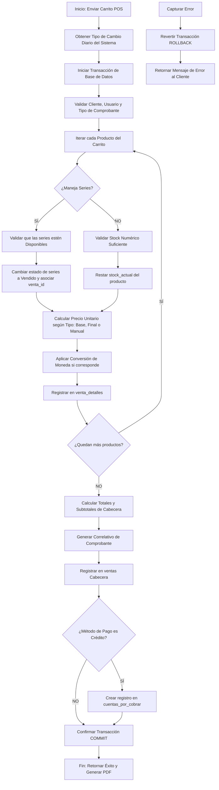

# Flujo Lógico y Pseudocódigo: Procesamiento de Venta Multi-Producto

Este documento detalla el flujo de negocio y el pseudocódigo transaccional para el procesamiento de una venta en el POS. El diseño incluye la validación de números de serie físicos, la selección flexible de precios, la congelación del tipo de cambio (TC) y el manejo seguro de transacciones en base de datos.

---

## 1. Diagrama de Flujo del Proceso



---

## 2. Pseudocódigo Transaccional (Nivel de Backend / Servicio)

A continuación, se presenta la implementación conceptual en pseudocódigo de un servicio de backend encargado de procesar la venta.

```typescript
function procesarVenta(datosVenta) {
    /**
     * Datos de entrada esperados (datosVenta):
     * {
     *   cliente_id: int,
     *   usuario_id: int,
     *   tipo_comprobante: string ("Factura" | "Boleta" | "Ticket"),
     *   moneda_venta: string ("PEN" | "USD"),
     *   metodo_pago: string ("Contado" | "Credito"),
     *   fecha_vencimiento: string (YYYY-MM-DD, opcional),
     *   items: [
     *     {
     *       producto_id: int,
     *       cantidad: int,
     *       tipo_precio: string ("Base" | "Final" | "Manual"),
     *       precio_manual: decimal (opcional),
     *       series_seleccionadas: string[] (obligatorio si el producto maneja series),
     *       meses_garantia: int
     *     }
     *   ]
     * }
     */

    // 1. Obtener Tipo de Cambio (TC) actual del sistema
    const tipoCambioSistema = ObtenerTipoCambioActual();
    
    // 2. Iniciar transacción en la Base de Datos
    DB.beginTransaction();

    try {
        let ventaSubtotal = 0.00;
        let ventaIgv = 0.00;
        let ventaTotal = 0.00;
        const detallesAInsertar = [];
        const seriesAActualizar = [];

        // 3. Validar la existencia del Cliente y Usuario
        const cliente = DB.query("SELECT * FROM actores WHERE id = ? AND (tipo = 'Cliente' OR tipo = 'Ambos')", [datosVenta.cliente_id]);
        if (!cliente) throw new Error("El cliente seleccionado no es válido.");

        const usuario = DB.query("SELECT * FROM usuarios WHERE id = ? AND activo = TRUE", [datosVenta.usuario_id]);
        if (!usuario) throw new Error("El usuario / vendedor no está activo.");

        // 4. Iterar y procesar cada ítem del carrito
        for (const item of datosVenta.items) {
            // Bloqueamos la fila del producto para evitar condiciones de carrera (Concurrency Control)
            const producto = DB.query("SELECT * FROM productos WHERE id = ? FOR UPDATE", [item.producto_id]);
            if (!producto) throw new Error(`El producto con ID ${item.producto_id} no existe.`);

            // A. VALIDACIÓN DE STOCK Y NÚMEROS DE SERIE
            if (producto.maneja_series === true) {
                // La cantidad de series enviada debe coincidir exactamente con la cantidad de productos
                if (!item.series_seleccionadas || item.series_seleccionadas.length !== item.cantidad) {
                    throw new Error(`Debe seleccionar exactamente ${item.cantidad} número(s) de serie para el producto '${producto.nombre}'.`);
                }

                for (const numeroSerie of item.series_seleccionadas) {
                    // Validar si la serie física existe y está disponible
                    const serieFisica = DB.query(
                        "SELECT * FROM producto_series WHERE producto_id = ? AND numero_serie = ? AND estado = 'Disponible' FOR UPDATE",
                        [producto.id, numeroSerie]
                    );

                    if (!serieFisica) {
                        throw new Error(`La serie '${numeroSerie}' del producto '${producto.nombre}' no está disponible o ya fue vendida.`);
                    }

                    // Guardamos la referencia para actualizar el estado más adelante
                    seriesAActualizar.push({
                        serie_id: serieFisica.id,
                        meses_garantia: item.meses_garantia
                    });
                }
            } else {
                // Validación para productos con stock tradicional (sin series)
                if (producto.stock_actual < item.cantidad) {
                    throw new Error(`Stock insuficiente para el producto '${producto.nombre}'. Disponible: ${producto.stock_actual}, Solicitado: ${item.cantidad}`);
                }
            }

            // B. SELECCIÓN DE PRECIO Y CONVERSIÓN DE MONEDA
            let precioUnitarioBaseMonedaOriginal = 0.00;

            if (item.tipo_precio === "Base") {
                precioUnitarioBaseMonedaOriginal = producto.precio_base;
            } else if (item.tipo_precio === "Final") {
                precioUnitarioBaseMonedaOriginal = producto.precio_final;
            } else if (item.tipo_precio === "Manual") {
                // Validar si el usuario tiene rol de 'Administrador' para aplicar precio manual
                if (usuario.rol !== "Administrador" && item.precio_manual !== producto.precio_final) {
                    throw new Error("No tiene permisos para modificar el precio de venta de manera manual.");
                }
                precioUnitarioBaseMonedaOriginal = item.precio_manual;
            }

            // NOTA: Asumimos que los precios en la BD de productos están configurados por defecto en SOLES (PEN).
            // Si la venta se realiza en DÓLARES (USD), aplicamos la tasa de cambio inversa.
            let precioUnitarioTransaccion = precioUnitarioBaseMonedaOriginal;
            if (datosVenta.moneda_venta === "USD") {
                precioUnitarioTransaccion = precioUnitarioBaseMonedaOriginal / tipoCambioSistema;
            }

            const itemSubtotal = precioUnitarioTransaccion * item.cantidad;
            ventaSubtotal += itemSubtotal;

            detallesAInsertar.push({
                producto_id: producto.id,
                cantidad: item.cantidad,
                tipo_precio: item.tipo_precio,
                precio_unitario: precioUnitarioTransaccion,
                meses_garantia: item.meses_garantia,
                subtotal: itemSubtotal
            });
        }

        // 5. CÁLCULO DE IMPUESTOS Y TOTALES DE CABECERA (IGV 18% en Perú, incluido en el total)
        // Fórmula para desglose: Subtotal_Sin_IGV = Total / 1.18; IGV = Total - Subtotal_Sin_IGV;
        ventaTotal = ventaSubtotal;
        const subtotalSinIgv = ventaTotal / 1.18;
        ventaIgv = ventaTotal - subtotalSinIgv;

        // 6. GENERAR CORRELATIVO AUTOMÁTICO DE COMPROBANTE
        // Bloquea la secuencia para evitar números de comprobantes duplicados en entornos multi-caja.
        const comprobanteSecuencia = DB.query(
            "SELECT serie, correlativo_actual FROM secuencias_comprobante WHERE tipo = ? FOR UPDATE", 
            [datosVenta.tipo_comprobante]
        );
        const nuevaSerie = comprobanteSecuencia.serie;
        const nuevoCorrelativo = comprobanteSecuencia.correlativo_actual + 1;

        // Actualizar la secuencia del comprobante en la base de datos
        DB.execute(
            "UPDATE secuencias_comprobante SET correlativo_actual = ? WHERE tipo = ?", 
            [nuevoCorrelativo, datosVenta.tipo_comprobante]
        );

        // 7. INSERTAR CABECERA DE LA VENTA (Congelando el tipo de cambio del momento)
        const ventaId = DB.execute(
            `INSERT INTO ventas (
                cliente_id, usuario_id, tipo_comprobante, serie_comprobante, correlativo_comprobante, 
                fecha_venta, moneda, tipo_cambio, metodo_pago, fecha_vencimiento, subtotal, igv, total, estado
            ) VALUES (?, ?, ?, ?, ?, NOW(), ?, ?, ?, ?, ?, ?, ?, 'Completada')`,
            [
                datosVenta.cliente_id, 
                datosVenta.usuario_id, 
                datosVenta.tipo_comprobante, 
                nuevaSerie, 
                nuevoCorrelativo.toString().padStart(8, '0'), 
                datosVenta.moneda_venta, 
                tipoCambioSistema, 
                datosVenta.metodo_pago, 
                datosVenta.metodo_pago === "Credito" ? datosVenta.fecha_vencimiento : null,
                subtotalSinIgv, 
                ventaIgv, 
                ventaTotal
            ]
        );

        // 8. INSERTAR DETALLES DE LA VENTA
        for (const detalle of detallesAInsertar) {
            DB.execute(
                `INSERT INTO venta_detalles (
                    venta_id, producto_id, cantidad, tipo_precio, precio_unitario, meses_garantia, subtotal
                ) VALUES (?, ?, ?, ?, ?, ?, ?)`,
                [
                    ventaId, 
                    detalle.producto_id, 
                    detalle.cantidad, 
                    detalle.tipo_precio, 
                    detalle.precio_unitario, 
                    detalle.meses_garantia, 
                    detalle.subtotal
                ]
            );

            // El trigger 'trg_venta_detalle_insert' en la base de datos restará automáticamente
            // el stock_actual del producto para registros tradicionales sin series.
        }

        // 9. ACTUALIZAR ESTADO DE LAS SERIES FÍSICAS ASOCIADAS
        for (const serie of seriesAActualizar) {
            const nuevoEstado = (serie.meses_garantia > 0) ? 'En Garantia' : 'Vendido';
            DB.execute(
                "UPDATE producto_series SET estado = ?, venta_id = ? WHERE id = ?",
                [nuevoEstado, ventaId, serie.serie_id]
            );
        }

        // 10. GESTIONAR CRÉDITOS (CUENTAS POR COBRAR)
        if (datosVenta.metodo_pago === "Credito") {
            if (!datosVenta.fecha_vencimiento) {
                throw new Error("Debe ingresar una fecha de vencimiento válida para ventas al crédito.");
            }
            DB.execute(
                `INSERT INTO cuentas_por_cobrar (
                    venta_id, cliente_id, monto_total, monto_pagado, fecha_vencimiento, estado
                ) VALUES (?, ?, ?, 0.00, ?, 'Pendiente')`,
                [ventaId, datosVenta.cliente_id, ventaTotal, datosVenta.fecha_vencimiento]
            );
        }

        // 11. CONFIRMAR TRANSACCIÓN
        DB.commit();

        return {
            exito: true,
            mensaje: "Venta procesada con éxito.",
            venta_id: ventaId,
            comprobante: `${nuevaSerie}-${nuevoCorrelativo.toString().padStart(8, '0')}`
        };

    } catch (error) {
        // En caso de cualquier error en la validación, stock o BD, revertimos todo
        DB.rollback();
        return {
            exito: false,
            mensaje: error.message
        };
    }
}
```
